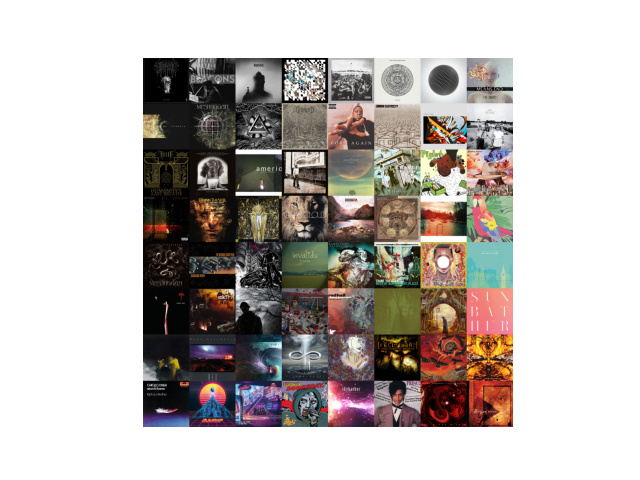

# artify
Create a mosaic from your favourite albums


## Usage
For a .csv file of albums:

```python
client_id = "XXX"
client_secret = "YYY"
redirect_url = "ZZZ"

artify = Artify(client_id, client_secret, redirect_url)

artify.pull_top_albums(100)
mosaic = artify.generate_mosaic()
```